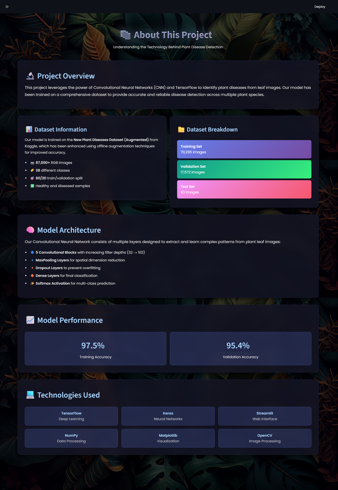

# Leaf Disease Detection System 🌿🔍

A deep learning-based web application designed to identify and classify plant diseases from leaf images. This project utilizes a Convolutional Neural Network (CNN) trained on a large dataset of healthy and diseased plant leaves to provide accurate disease recognition.

## � Screenshots

### Dashboard / Home Page


### About Page


### Disease Prediction


## �📋 Table of Contents
- [About the Project](#about-the-project)
- [Features](#features)
- [Dataset](#dataset)
- [Technologies Used](#technologies-used)
- [Installation](#installation)
- [Usage](#usage)
- [Model Architecture](#model-architecture)
- [Performance](#performance)

## 📖 About the Project
The **Leaf Disease Detection System** aims to assist farmers and agricultural enthusiasts in early detection of plant diseases. By uploading an image of a plant leaf, the system analyzes it using a trained TensorFlow model and predicts the specific disease (or if the plant is healthy). The application is built with a user-friendly interface using Streamlit.

## ✨ Features
- **Disease Recognition**: Capable of classifying 38 different classes of plant diseases and healthy leaves.
- **User-Friendly Interface**: Simple web interface built with Streamlit for easy image uploading and prediction.
- **Real-time Prediction**: Fast processing and result display.
- **Visualization**: Displays the uploaded image alongside the prediction result.

## 📂 Dataset
The model is trained on the **New Plant Diseases Dataset** (Augmented) available on Kaggle.
- **Source**: [Kaggle - New Plant Diseases Dataset](https://www.kaggle.com/datasets/emmarex/plantdisease)
- **Content**: Approximately 87,000 RGB images.
- **Classes**: 38 different classes (e.g., Apple Scab, Tomato Early Blight, Healthy, etc.).
- **Split**: The dataset is divided into Training (80%) and Validation (20%) sets.

## 🛠 Technologies Used
- **Programming Language**: Python
- **Deep Learning Framework**: TensorFlow / Keras
- **Web Framework**: Streamlit
- **Data Manipulation**: NumPy, Pandas
- **Visualization**: Matplotlib, Seaborn

## ⚙️ Installation

1. **Clone the Repository**
   ```bash
   git clone <repository-url>
   cd <repository-folder>
   ```

2. **Create a Virtual Environment (Optional but Recommended)**
   ```bash
   python -m venv venv
   # Activate on Windows
   venv\Scripts\activate
   # Activate on macOS/Linux
   source venv/bin/activate
   ```

3. **Install Dependencies**
   Ensure you have the required libraries installed. You can install them using pip:
   ```bash
   pip install tensorflow streamlit numpy pandas matplotlib seaborn
   ```

## 🚀 Usage

1. **Train the Model (Optional)**
   If you want to retrain the model, run the Jupyter Notebook:
   - Open `train_plant_disease.ipynb` in VS Code or Jupyter Notebook.
   - Run the cells to train and save the model as `trained_plant_disease_model.keras`.
   *Note: A pre-trained model `trained_plant_disease_model.keras` is already included.*

2. **Run the Application**
   Start the Streamlit web server:
   ```bash
   streamlit run main.py
   ```

3. **Interact with the App**
   - The app will open in your default web browser.
   - Navigate to the **Disease Recognition** page using the sidebar.
   - Upload a clear image of a plant leaf.
   - Click the **Predict** button to see the result.

## 🧠 Model Architecture
The model is a Convolutional Neural Network (CNN) built with TensorFlow/Keras, consisting of:
- **Convolutional Layers**: 5 blocks of Conv2D layers with ReLU activation to extract features.
- **Pooling Layers**: MaxPool2D layers to reduce spatial dimensions.
- **Dropout Layers**: To prevent overfitting.
- **Dense Layers**: Fully connected layers for classification.
- **Output Layer**: Softmax activation with 38 units (one for each class).

## 📊 Performance
- **Training Accuracy**: ~97%
- **Validation Accuracy**: ~95%
- **Loss**: Low categorical cross-entropy loss indicating good convergence.

See `training_hist.json` for detailed training metrics.

## 📁 Project Structure
```
├── main.py                       # Streamlit application entry point
├── train_plant_disease.ipynb     # Notebook for data preprocessing and model training
├── test_plant_disease.ipynb      # Notebook for testing the model
├── trained_plant_disease_model.keras # Saved trained model file
├── training_hist.json            # JSON file containing training history
└── README.md                     # Project documentation
```
